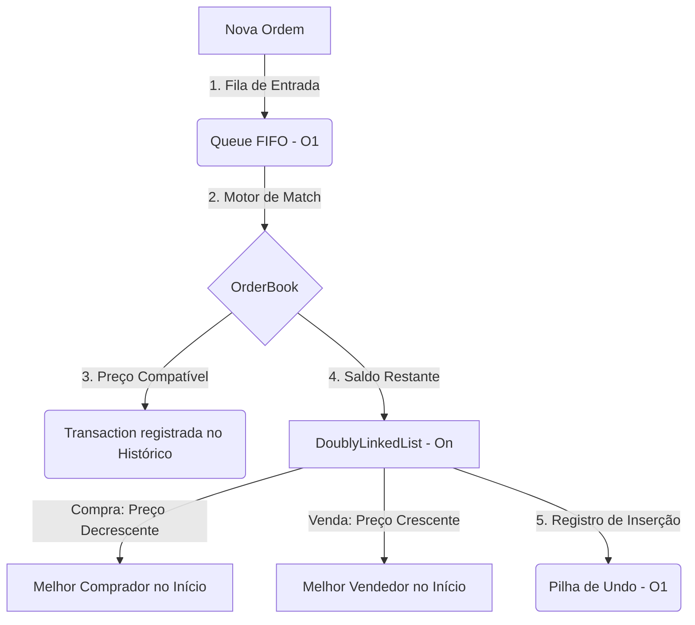

# Simulador de Livro de Ofertas (Order Book) e Performance de Estruturas

Este projeto consiste em um **Motor de Negociação Financeira (Matching Engine)** simplificado, desenvolvido como trabalho prático para a disciplina de **Estrutura de Dados em Python** (Semestre 2026).

Este documento funciona tanto como a documentação técnica oficial quanto como o **Guia de Apresentação e Defesa Oral** do projeto para a sala e o professor.

---

## 👥 Autores (Grupo 5)

| Nome do Integrante | RA | Módulo Desenvolvido | Pasta do Repositório |
| :--- | :--- | :--- | :--- |
| **Eduardo Affonso Boide Santos** | 16862544 | Classes Base (`Order`, `Node`) e Lista Duplamente Encadeada | `/Eduardo` |
| **Felipe Alirio Baruja** | 15636442 | Menu Interativo via Terminal e Validações de Entrada | `/Felipe` |
| **Fernando Lacerda Dantas** | 17097341 | Fila de Entrada (`Queue`) e Pilha de Desfazer (`Stack`) | `/Fernando` |
| **Nicolas Gonçalves Follone** | 16827586 | Entidade `Transaction` e Histórico Encadeado (`TransactionHistory`) | `/Nicolas` |
| **Victor Hugo Aparecido Galho Trasancos** | 16839040 | Livro de Ofertas (`OrderBook`) e Motor de Casamento (*Match*) | `/Victor` |

---

## 📢 Guia de Apresentação (Roteiro e Defesa Oral)

Use esta seção como roteiro de slides ou falas durante a apresentação em sala de aula. Cada integrante deve apresentar sua contribuição técnica focando nos critérios avaliados pelo professor: **Lógica de Ponteiros**, **Orientação a Objetos** e **Análise de Performance**.



### 🔹 Slide/Fala 1: Introdução e Desafio (Apresentador Geral)
* **Conceito**: Como funciona um motor de negociação de bolsa de valores?
* **O Desafio**: Casar ordens de compra e venda de ativos com prioridade de preço e tempo.
* **A Restrição**: Construir todas as coleções dinâmicas a partir de referências físicas em memória (nós e ponteiros), sem utilizar as listas nativas `list()` ou `collections.deque` do Python.

### 🔹 Slide/Fala 2: Classes Base e Lista Duplamente Encadeada (Eduardo - RA: 16862544)
* **Entidade `Order`**: Encapsula ID, tipo ('C'/'V'), preço, quantidade e timestamp.
* **Estrutura `DoublyLinkedList`**:
  * Implementação com ponteiros `head`, `tail`, `next` e `prev`.
  * **Inserção Ordenada ($O(n)$)**: A lista de compras é mantida em ordem decrescente de preço (melhor preço no início). A lista de vendas é em ordem crescente (menor preço no início).
  * **Prioridade Temporal (FIFO)**: Uso de operadores de desigualdade estrita (`>` e `<`) na busca pela posição. Se os preços forem idênticos, a ordem nova é inserida *após* as antigas, preservando a prioridade temporal.
  * **Remoção ($O(n)$)**: Religamento cirúrgico de ponteiros para evitar nós órfãos e vazamento de memória.

### 🔹 Slide/Fala 3: Fila de Entrada e Pilha de Undo (Fernando - RA: 17097341)
* **Fila de Entrada (`Queue`)**:
  * Estrutura FIFO (First-In, First-Out). Todas as ordens são colocadas na fila antes do processamento.
  * Operações de extremidade (`enqueue` e `dequeue`) implementadas em **$O(1)$** usando referências para o primeiro nó (`_front`) e o último nó (`_rear`).
* **Pilha de Undo (`Stack`)**:
  * Estrutura LIFO (Last-In, First-Out). Armazena os IDs das ordens inseridas nos livros com sucesso.
  * Permite remover instantaneamente ($O(1)$) a última ordem enviada ao livro sem afetar o histórico ou outras ordens.

### 🔹 Slide/Fala 4: Transações e Histórico Encadeado (Nicolas - RA: 16827586)
* **Entidade `Transaction`**: Registra o casamento de ordens: ID da compra, ID da venda, preço praticado, quantidade de ações transacionadas e o timestamp do momento exato.
* **Histórico (`TransactionHistory`)**:
  * Implementado como uma **Lista Encadeada Simples** (com nós `NodeTransaction`), evitando o uso de `list` nativo.
  * Inserção eficiente no final da cadeia ($O(1)$) mantendo o registro cronológico completo de negociações do mercado.

### 🔹 Slide/Fala 5: Livro de Ofertas e Motor de Match (Victor - RA: 16839040)
* **Integração (`OrderBook`)**: Centraliza a Fila, os Livros de Oferta, a Pilha de Undo e o Histórico de Transações.
* **Lógica de Casamento (*Match Engine*)**:
  * Um match ocorre quando o preço de compra do melhor comprador é **maior ou igual** ao preço de venda do melhor vendedor (`preco_compra >= preco_venda`).
  * O preço da transação é determinado pelo preço da ordem que **já estava no livro** (prioridade de quem proveu liquidez ao mercado).
  * **Match Parcial**: Se as quantidades diferirem, abate-se o saldo e a ordem remanescente continua no livro. A ordem zerada é removida do topo ($O(1)$).

### 🔹 Slide/Fala 6: Interface e Execução (Felipe - RA: 15636442)
* **Menu do Terminal**: Desenvolvido de forma robusta e à prova de falhas com validações rígidas.
* **Opção de Inspeção Visual**: Implementado o método `mostrar_fila_entrada` no menu interativo para permitir ao professor ver exatamente o estado da fila FIFO *antes* de rodar o processamento.
* Fluxo de navegação intuitivo com sanitização de tipos (ex: aceita vírgulas ou pontos em floats e normaliza strings).

### 🔹 Slide/Fala 7: Análise de Complexidade Assintótica (Teoria)
| Estrutura / Algoritmo | Operação | Complexidade Teórica | Justificativa |
| :--- | :--- | :--- | :--- |
| **Fila de Entrada** | Inserção (`enqueue`) / Remoção (`dequeue`) | $O(1)$ | Manipulação direta dos ponteiros de extremidade (`front`/`rear`). |
| **Pilha de Undo** | Empilhar (`push`) / Desempilhar (`pop`) | $O(1)$ | Inserção e remoção feitas exclusivamente no topo (`head`). |
| **Livro de Ofertas** | Inserção Ordenada | $O(n)$ | Requer varredura linear para encontrar a posição correta de preço. |
| **Livro de Ofertas** | Remoção por ID (Undo) | $O(n)$ | Busca linear pelo ID antes da religação de ponteiros. |
| **Motor de Match** | Casamento de Ordens | $O(1)$ comparativo | O topo de cada livro é acessado instantaneamente ($O(1)$). |

### 🔹 Slide/Fala 8: Teste Empírico e Resultados (Prática)
* Experimento realizado em Jupyter Notebook ([performance_tests.ipynb](notebook/performance_tests.ipynb)).
* Avaliado com lotes aleatórios de 1.000, 5.000 e 10.000 ordens.
* **Conclusão**: Conforme o livro acumula ordens, o gargalo assintótico da inserção ordenada na lista encadeada ($O(n)$) cresce de forma aproximadamente quadrática ($O(n^2)$ acumulado), enquanto o custo da Fila e da Pilha permanece perfeitamente controlado em $O(1)$. Esse estudo comprova a necessidade prática de evolução para estruturas não-lineares (como Heaps e Árvores Rubro-Negras) no mercado real.

---

## 🚀 Como Executar o Simulador

### Pré-requisitos
* Python 3.x instalado.
* Biblioteca `matplotlib` instalada (necessária para os gráficos no Jupyter Notebook).

### Executar o Sistema Principal
Rode o script unificado na raiz do repositório:
```bash
python simulador_livro_ofertas.py
```

### Executar os Testes de Performance
Inicie o Jupyter Notebook:
```bash
jupyter notebook notebook/performance_tests.ipynb
```
Execute as células para visualizar as tabelas de performance e as plotagens de gráficos.
